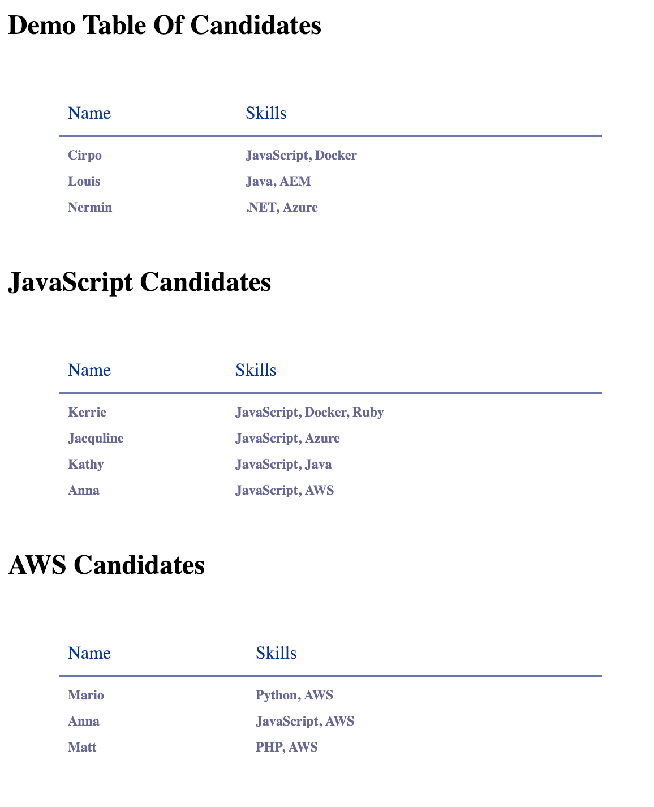

# Candidates

This app shows a table of demo candidates with name and skill columns, as well as candidates that have been filtered according to the skill specified in the header of the table.

To view the page please open the `index.html` file in your browser.

## Running the tests
Tests have been written using Jasmine and can be found in the `spec` folder. If you are interested in running these, please open the `SpecRunner.html` file in your browser.

## My Approach to this Problem
I decided to TDD my solution to the `filterCandidateBySkill` function, which allowed me to isolate the function and test just the functionality that I was trying to achieve - returning a list of candidates that have been filtered by skill.

I was then able to drop in the `filterCandidateBySkill` function and use provided functions to display the candidates on the page.

## Without time restrcition I would...
Given more time I would have separated functions in to new files, reducing logic in the html file. I would also ensure that these were all fully tested.

I am aware of the duplication created by having a `filterCandidates.js` file and the function in the `index.html` file, but chose to leave the function in the `index.html` file for clarity and readability.

I would have also handled edge cases for example when a skill was passed as an argument to `filterCandidateBySkill` that no candidates had listed or perhaps allow a table that filters using more than one skill.
